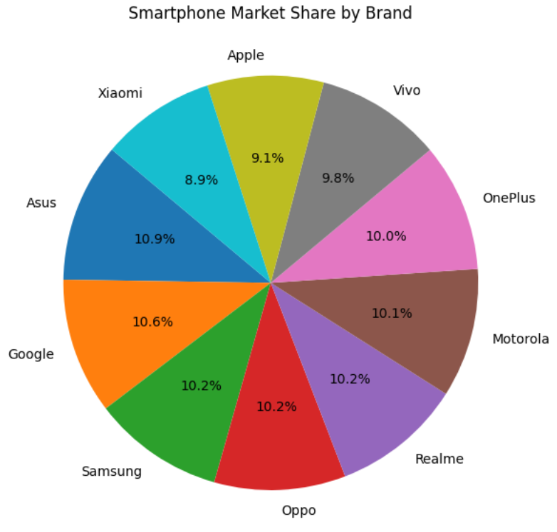
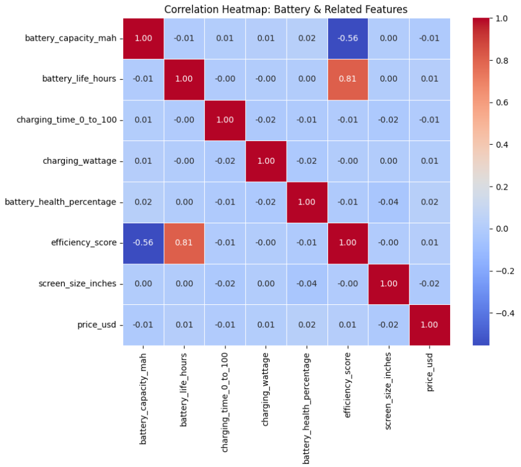
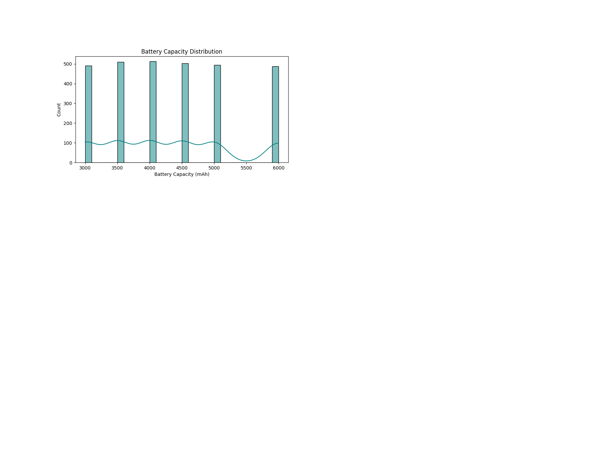

# 📊 Data Analysis Using Python

## 📌 Project Overview
This project focuses on performing data analysis using Python libraries such as Pandas, NumPy, Matplotlib, and Seaborn.  
The goal is to clean, analyze, and visualize data to extract meaningful insights.

## 🛠️ Tools & Technologies
- Python
- Pandas
- NumPy
- Matplotlib
- Seaborn
- Jupyter Notebook

## 📂 Dataset - smartphone_battery_life_analysis
- Source: https://drive.google.com/file/d/14juMEfeTVYwJbPl6OysUuPIoYOH4D_oQ/view?usp=sharing
- Purpose: The dataset is designed to analyze relationships between device usage patterns and battery performance,enabling insights through exploratory data analysis and visualization.

**Structure:**
- Format: CSV
- Rows: ~4,000
- Columns: 8

**Key Columns:**
- `battery_capacity` – Battery capacity of the device (mAh)
- `screen_time` – Average daily screen-on time (hours)
- `charging_time` – Time taken for a full charge (hours)
- `usage_type` – Category of device usage
- `battery_life` – Total battery life (target variable)

## 🔍 Key Tasks Performed
- Data cleaning and preprocessing
- Handling missing values
- Exploratory Data Analysis (EDA)
- Data visualization using charts and graphs
- Insights generation

## 📈 Sample Visualizations

1️⃣ Pie Chart – Category Distribution


2️⃣ Correlation Heatmap – Feature Relationships


3️⃣ Histogram – Data Distribution


4️⃣ Box Plot – Outlier Detection


5️⃣ Scatter Plot – Relationship Analysis


## 🚀 How to Run the Project
```bash
pip install -r requirements.txt
jupyter notebook
